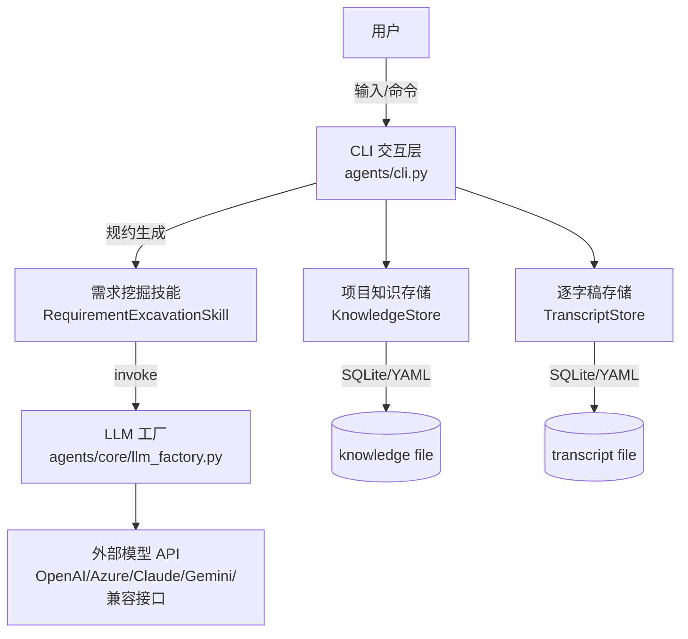

# ReqX

**基于 LLM 的需求挖掘与规约生成工具**。通过多轮对话澄清模糊需求，自动生成结构化工程规约 (YAML)。

## 📑 目录

- [✨ 核心功能](#-核心功能)
- [🛠️ 技术栈](#️-技术栈)
- [🏗️ 架构](#️-架构)
- [🚀 快速开始](#-快速开始)
  - [安装](#1-安装)
  - [配置](#2-配置)
  - [运行](#3-运行)
- [💡 使用指南](#-使用指南)
- [🤖 支持的模型配置](#-支持的模型配置)
- [📚 文档导航](#-文档导航)
- [🛠️ 开发者工具](#️-开发者工具)
- [📄 License](#-license)

## ✨ 核心功能

*   **深度挖掘**: 主动追问识别隐性需求与边界条件，而非简单的记录员。
*   **结构化输出**: 生成包含根目标、解决方案、风险评估、验收标准的标准 YAML 文档。
*   **知识沉淀**: 自动提取关键决策点并持久化，支持断点续聊。
*   **多模型支持**: 适配 OpenAI, Azure, Claude, Gemini 及所有 OpenAI 兼容接口。
*   **安全合规**: 密钥环境变量管理，日志自动脱敏。
*   **扩展性**: 内置 Web API (`/v1/chat/send`) 与配置诊断接口，支持 SQLite/YAML 双存储后端。

---

## 🛠️ 技术栈

*   **LangChain**: 统一 LLM 接口调用与模型适配。
*   **CrewAI**: Agent 工具接口标准 (`BaseTool`) 实现与编排支持。
*   **PyYAML**: YAML 格式规约生成、解析与配置文件管理。
*   **HTTPX**: 底层 HTTP 客户端，处理 API 请求与连通性测试。

---

## 🏗️ 架构

本项目采用分层结构：CLI 负责交互与状态管理；需求挖掘技能负责“把信息变成规约”；模型工厂负责不同 LLM 的统一接入；存储模块负责知识与对话记录的持久化。



## 🚀 快速开始

### 1. 安装

首先克隆仓库，并安装到当前环境（可编辑模式）：

```bash
git clone <repository_url>
cd reqx

python -m pip install -e .
```

### 2. 配置

本项目支持三种“初始配置”路径：
- 终端命令 + 参数一键配置（适合 CI）：`reqx init-config --config-out llm.yaml`
- 终端交互式向导：`reqx wizard`
- WebUI 中编辑配置：`reqx web --config llm.yaml` → 浏览器“配置”页签

初始化配置文件（交互式，适合本地首次上手）：

```bash
reqx init-config
```

这会提示你选择配置文件输出路径（也可用 `--config-out` 直接指定）。请根据你的模型服务商编辑该文件（详见下文“支持的模型”）。
同时，请在项目根目录创建 `.env` 文件填入 API Key：

```env
OPENAI_API_KEY=YOUR_OPENAI_API_KEY
```

一键配置（非交互，适合脚本/CI）：

```bash
reqx init-config --config-out llm.yaml
reqx check-api --config llm.yaml
```

交互式向导（生成配置 → 可选写入 env → 可选健康检查）：

```bash
reqx wizard
```

### 3. 运行

一切就绪！启动 CLI 开始对话：

```bash
# 启动交互式终端
reqx

# 或者使用 Python 模块运行
python -m agents
```

---

## 💡 使用指南

进入 `reqx` 终端后，你可以像聊天一样描述你的想法。

**常用指令：**

| 指令 | 说明 |
| :--- | :--- |
| `/spec` | **核心功能**。基于当前对话生成需求规约 YAML（预览模式）。 |
| `/done` | **完成任务**。生成最终版规约，自动构思项目名称，并结束流程。 |
| `/show` | 显示当前已提取的项目知识。 |
| `/reset` | 清空本轮对话记录，并清空落盘逐字稿（保留已提取的知识）。 |
| `/exit` | 退出程序。 |

非交互（CI）常用方式：
- `reqx --help` 查看全部参数与用法
- `reqx spec --config llm.yaml --knowledge path/to/project_knowledge.db`
- `reqx done --config llm.yaml --knowledge path/to/project_knowledge.db --auto-pick-name`

逐字稿默认行为：
- 若你把 `--transcript` 指向一个已存在的文件，默认会视为**新会话**并清空旧逐字稿；如需继续追加，用 `--resume-transcript`。

WebUI（本机）：
- `reqx web --config llm.yaml --bind 127.0.0.1 --port 8788`
- 该命令会启动本机 Web 服务器并占用终端；交互式终端下会尝试自动打开浏览器；停止服务按 `Ctrl+C`。
- 建议设置 `REQX_WEB_TOKEN` 保护写入类接口（chat/send、config/prompt write）。WebUI 左侧的 `Token` 输入框用于填入同一个 token，浏览器会用 `Authorization: Bearer <token>` 携带它；config/prompt read 返回内容会做脱敏处理。详见 [doc/06_auth_and_security.md](doc/06_auth_and_security.md)。

**对话示例：**

> **User**: 我想做一个背单词 App。
>
> **Agent**: 好的。针对这个 App，您的目标用户群体主要是谁？（例如：考研学生、出国留学党、还是职场人士？）
>
> **User**: 主要是考研党。
>
> **Agent**: 明白了。对于考研党来说，真题词汇非常重要。您是否需要系统支持导入历年真题 PDF？另外，记忆算法方面是否强制要求使用艾宾浩斯遗忘曲线？
>
> *(Agent 会自动记录：用户=考研党，功能=PDF导入，算法=艾宾浩斯)*

---

## 🤖 支持的模型配置

本项目通过 `llm.yaml` 支持多种主流大模型。

### OpenAI / DeepSeek (兼容模式)
```yaml
provider: openai_compatible
model: deepseek-chat
base_url: https://api.deepseek.com
api_key_env: DEEPSEEK_API_KEY
```

### Azure OpenAI
```yaml
provider: azure
model: gpt-4
azure_endpoint: https://your-resource.openai.azure.com/
azure_deployment: your-deployment-name
azure_api_version: 2024-02-15-preview
api_key_env: AZURE_OPENAI_API_KEY
```

### Anthropic (Claude)
```yaml
provider: anthropic
model: claude-3-5-sonnet-20240620
api_key_env: ANTHROPIC_API_KEY
```

---

## 📚 文档导航

更多详细信息，请查阅 `doc/` 目录下的文档：

*   [**01_项目总述**](doc/01_project_overview.md)：架构设计与设计理念。
*   [**02_脚本与模块详解**](doc/02_scripts_and_modules.md)：深入代码实现细节。
*   [**03_使用说明书**](doc/03_user_manual.md)：详细的操作手册与 FAQ。
*   [**04_CLI 参数参考**](doc/04_cli_reference.md)：所有命令、所有参数与 CI/交互使用场景。
*   [**05_全流程操作案例**](doc/05_end_to_end_workflow.md)：从安装到产出规约的端到端案例。
*   [**06_鉴权 Token 与安全建议**](doc/06_auth_and_security.md)：Token 是什么、为什么要用、如何设置与接口调用示例。

---

## 🛠️ 开发者工具

推荐使用 `reqx` 的子命令：

*   `reqx check-api --config llm.yaml`：健康检查（测试 LLM 连接是否正常）。
*   `reqx clean`：一键清理（删除缓存与构建产物）。
*   `reqx check-deps`：依赖检查（确认环境是否完整）。
*   `reqx install`：安装本仓库（可编辑模式）。
*   `reqx init-config`：生成配置文件。
*   `reqx wizard`：一键配置向导（生成配置/写入 env/健康检查）。

WebUI 前端工程（Vite + React + Tailwind）：
- 源码在 `agents/web/ui/`；服务端实际返回的是构建导出的 `agents/web/static/webui.html`
- 修改前端后，在 `agents/web/ui/` 目录执行 `npm run build:webui` 重新导出

---

## 📄 License

[MIT License](LICENSE)
