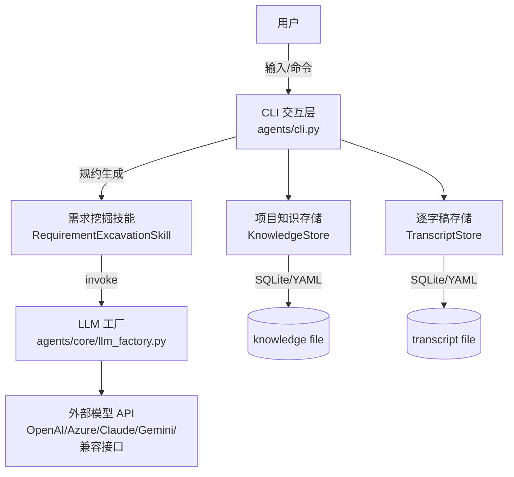

# 项目总述 (Project Overview)

## 1. 项目简介

**ReqX** 是一个智能化的需求分析辅助工具，专为独立创作者设计。它的核心使命是解决软件开发中最头疼的问题之一——**需求模糊与沟通成本高**。

在传统的开发流程中，需求往往通过口头沟通或零散的文档传递，容易遗漏细节，导致后期返工。本项目利用大语言模型（LLM），通过**人机对话**的形式，主动挖掘用户潜意识里的需求，并自动整理成结构化、标准化的**项目规约（Specification）**。

简单来说，它就像一位经验丰富的产品经理，耐心地引导你把想法说清楚，并帮你写好需求文档。

## 2. 核心理念

本项目的设计遵循以下几个核心理念：

*   **交互式挖掘 (Interactive Excavation)**：需求不是一次性“写”出来的，而是通过“问”出来的。系统会根据你当前的描述，追问缺失的细节（如：目标用户是谁？核心功能有哪些？有哪些技术限制？）。
*   **结构化输出 (Structured Output)**：对话是随意的，但结果必须是严谨的。系统最终会生成一份符合预定义格式的 YAML 文档，包含“根目标”、“解决方案”、“风险”、“验证标准”等字段。
*   **知识沉淀 (Knowledge Retention)**：在对话过程中，系统会自动提取关键信息（项目知识），并将其持久化保存。即使对话被打断，下次回来也能基于已有的知识继续。
*   **模型无关性 (Model Agnostic)**：不绑定特定的大模型，支持 OpenAI、Azure OpenAI、Anthropic Claude、Google Gemini 以及任何兼容 OpenAI 接口的模型（如 DeepSeek、xAI Grok 等）。

## 3. 架构设计

项目采用分层架构设计，各模块职责如下：

### 3.1 整体架构图

### 3.2 模块详解

#### 1. 交互层 (Interaction Layer)
*   **入口**: `agents/cli.py`
*   **职责**: 提供终端聊天界面，处理用户指令（`/spec`, `/done`），管理会话状态。
*   **核心机制**: **无感知识提取**。
    *   LLM 在回复时会根据 Prompt 指令，将关键信息封装在 `<KNOWLEDGE>{"append": [...]}</KNOWLEDGE>` 标签中。
    *   CLI 层会自动拦截并解析该标签，将数据存入知识库，同时剥离标签，仅向用户展示自然语言回复，实现“边聊边记”的流畅体验。

#### 2. 智能层 (Intelligence Layer)
*   **核心**: `agents/core/requirement_excavation_skill.py`
*   **职责**:
    *   **Prompt Engineering**: 构造包含版本号（如 `_PROMPT_VERSION = "2026-01-30"`）的复杂 Prompt。
    *   **Schema 校验**: 强制 LLM 输出 JSON 并校验字段完整性。对 `demand_id` 等关键字段具备自动修正能力（如缺失时重置为 `auto_generated`），确保数据质量。

#### 3. 基础设施层 (Infrastructure Layer)
*   **LLM 工厂 (`agents/core/llm_factory.py`)**: 统一不同 LLM Provider 接口，实现配置读取与密钥脱敏。
*   **存储模块 (Dual Backend)**:
    *   **架构**: 支持 SQLite 与 YAML 双后端。
    *   **可靠性**: YAML 写入采用原子操作（先写 `.tmp` 再 `os.replace`），防止断电导致文件损坏。
    *   **可扩展性**: 数据结构包含 `schema_version` 字段，为未来的数据迁移预留了能力。

## 4. 关键特性

*   **自动知识提取**：系统会在后台默默“记笔记”。当你在对话中确认了一个关键点，系统会生成一个隐形的 `<KNOWLEDGE>` 标记，将其存入知识库，而不会干扰正常的聊天界面。
*   **一键生成规约**：随时输入 `/spec`，系统就会根据当前掌握的所有信息，整理出一份条理清晰的需求文档。
*   **自我诊断**：内置 `doctor` 模式，可以自动检查配置文件、环境变量和网络连通性，帮助你快速定位问题。
*   **安全第一**：所有的密钥配置都优先从环境变量读取，避免硬编码在代码中。输出日志时会自动隐藏敏感信息。

---
*下一步，请阅读 `02_脚本与模块详解.md` 了解具体的代码实现，并查看 `04_cli_reference.md` 获取所有命令与参数。*
